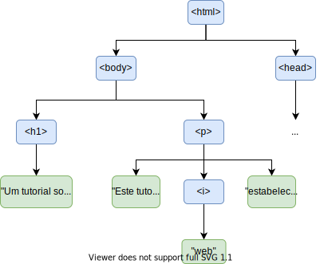

# Visão Geral do HTML e CSS

- HTML: *HyperText Markup Language*.
- Linguagem de **marcação** para documentos **hipertexto**.
	- **Marcação**: anotação feita no conteúdo para alterar suas propriedades.
		- _e.g._, fonte, cor de fundo, tamanho, ...
	- **Hipertexto**: texto que contém referências a outros textos, imagens, sons, ...
- Permite criar documentos contendo:
	- Texto.
	- Formatações especiais.
	- Imagens.
	- Tabelas.
	- Vídeos.
	- Sons.
	- Referências a outros documentos.
	- ...

## Estrutura de um Documento

- Documento é formado por uma hierarquia de **elementos**.
- No nível mais alto de abstração, documento HTML contém dois elementos:
	- `head`: 
		- Metadados.
		- Configurações.
		- Definições gerais.
	- `body`:
		- O conteúdo textual propriamente dito.


    ```html
    <!DOCTYPE html>
    <html>
        <head>
            ...
        </head>

        <body>
            ...
        </body>
    </html>
    ```

- Cada nó da hierarquia corresponde a um elemento.
    - Um elemento é envolvido por uma _tag_, de início e de fim (opcional).
	- Exemplo: `<nomeDaTag> filhos </nomeDaTag>`.
- Elementos são aninhadas, criando a hierarquia.

    ```html
    <!DOCTYPE html>
    <html>
        <head>
        </head>

        <body>
            <h1>Um tutorial sobre HTML</h1>

            <p>Este documento <i>web</i> estabelece alguns...</p>
        </body>
    </html>
    ```

- Hierarquia:




### _Tags_ Aplicáveis ao `head`

| Nome da _Tag_ | Propósito                                            |
| ------------- | ---------------------------------------------------- |
| `script`      | Carrega ou define _script_ executado sobre a página  |
| `title`       | Define um título para a página                       |
| `style`       | Define estilos aplicados aos elementos da página     |
| `meta`        | Define metadados sobre a página                      |
| `link`        | Carrega algum recurso externo à página (_e.g._, CSS) |

### _Tags_ Típicas de Formatação

| Nome da _Tag_         | Propósito                                                    |
| --------------------- | ------------------------------------------------------------ |
| `h1`, `h2`, ..., `h6` | Definir cabeçalhos (_e.g._, de seções)                       |
| `i`, `b`, `s`, `u`    | Fonte em itálico, negrito, tachado, sublinhado               |
| `p`                   | Define um parágrafo                                          |
| `table`               | Define uma tabela                                            |
| `th`                  | Define a linha de cabeçalho de uma tabela                    |
| `tr`                  | Define uma linha normal de tabela                            |
| `td`                  | Define uma célula em uma linha de tabela                     |
| `br`                  | Quebra uma linha                                             |
| `span`                | Define um trecho de texto (_e.g._, para formatação especial) |
| `a`                   | Cria um hiperlink para outro documento                       |
| `ul`, `ol`            | Criam listas de itens (sem ou com numeração)                 |
| `li`                  | Cria um item em uma lista.                                   |


```html
<!DOCTYPE html>
<html>
	<head>
	</head>
	<body>
		<h1>Título</h1>
        <h2>Seção</h2>
        Uma <b>tabela</b>:<br>
		<table>
            <tr><th>Col 1</th><th>Col 2</th></tr>
            <tr><td><s>val 1</s></td><td><u>val 2</u></td></tr>
            <tr><td><a href="outraPagina.html">val 3</a></td><td>val 4</td></tr>
        </table>
		<ul><li>Um item</li><li>Segundo item</li></ul>
	</body>
</html>
```

- Exemplo disponível em: [html-samples/Exemplo1.html](html-samples/Exemplo1.html)


### _Tags_ de Elementos Multimídia

| Nome da _Tag_ | Propósito          |
| ------------- | ------------------ |
| `img`         | Inserção de imagem |
| `video`       | Inserção de vídeo  |
| `audio`       | Inserção de áudio  |


```html
<!DOCTYPE html>
<html>
	<head>
	</head>
	<body>
		</img>
	</body>
</html>
```

- Exemplo disponível em: [html-samples/Exemplo2.html](html-samples/Exemplo2.html)

### Campos das _Tags_

- Várias _tags_ recebem parâmetros através de seus **campos**.
- Os campos são do tipo `nomeCampo="valor"` e aparecem após o nome da _tag_.
	- Exemplo: ``
	- Campo `src` define o caminho da imagem a ser exibida.
- Cada _tag_ tem seus campos possíveis padronizados.
<!--	- Alguns exemplos típicos: -->

| Nome do campo | Propósito                                    | Algumas _tags_ às quais se aplica |
| ------------- | -------------------------------------------- | --------------------------------- |
| `src`         | Caminho do recurso associado ao elemento     | `img`, `audio`, `video`, `script` |
| `id`          | Define identificador do elemento             | Muitos                            |
| `class`       | Associa elemento a uma classe                | Muitos                            |
| `style`       | Altera características de estilo do elemento | Muitos                            |
| `width`       | Configura a largura do elemento              | Muitos                            |
| `height`      | Configura a altura do elemento               | Muitos                            |
::::

### Campos das _Tags_ (Exemplo)

```html
<!DOCTYPE html>
<html>
	<head>
	</head>
	<body>
        <table class="tipoTabela" id="tab1" width="50px">
            <tr><th>Col 1</th><th>Col 2</th></tr>
            <tr><td><s>val 1</s></td><td><u>val 2</u></td></tr>
            <tr><td>val 3</td><td>val 4</td></tr>
        </table>

        <table class="tipoTabela" id="tab2" style="width: 150px">
            <tr><th>Col 1</th><th>Col 2</th></tr>
            <tr><td><s>val 1</s></td><td><u>val 2</u></td></tr>
            <tr><td>val 3</td><td>val 4</td></tr>
        </table>

    </body>
</html>
```

- Exemplo disponível em: [html-samples/Exemplo3.html](html-samples/Exemplo3.html)


### A _Tag_ `div`

- Um `div` é um elemento que agrega outros elementos.
	- Cria uma **divisão** no documento contendo uma parte do conteúdo.
- São muito úteis para organizar logicamente o documento.
- Em certas situações, permitem também aplicar regras de estilo a vários elementos de uma só vez.
	- Os elementos filhos do `div`.

```html
<!DOCTYPE html>
<html>
	<head>
	</head>
	<body>
        <div style="color: red; border: 1px solid;">
            <p>Primeiro parágrafo</p>
            <p>Segundo parágrafo</p>
        </div>
    </body>
</html>
```

- Exemplo disponível em: [html-samples/Exemplo4.html](html-samples/Exemplo4.html)


### Formulários

- Criados com a _tag_ `form`.
- Permitem obter entradas do utilizador.
	- Em geral, para envio ao servidor.
- Podem conter elementos como botões, entradas de texto, _checkboxes_, _radiobuttons_, ...
	- Criados com a _tag_ `input`, variando-se o campo `type`.
	- Exemplos:

| `type`     | Propósito              | Exemplo                                        |
| ---------- | ---------------------- | ---------------------------------------------- |
| `button`   | Cria um botão          | `<input type="button" value="Carregue aqui!">` |
| `text`     | Cria uma caixa de texto | `<input type="text">`                         |
| `password` | Cria uma caixa de palavra-passe | `<input type="password">`  |
| `checkbox` | Cria um _checkbox_     | `<input type="checkbox" value="opcao1">`       |


- Na maioria dos casos, um `input` pode/deve ter um `label` associado.
	- Associa um texto ao `input`.
- Exemplo:

    ```html
    <!DOCTYPE html>
    <html>
        <head>
        </head>
        <body>
            <form>
                <label for="nome">Nome:</label>
                <input type="text" id="nome"><br><br>
                <label for="apelido">Apelido:</label>
                <input type="text" id="apelido"><br><br>            
                <input type="checkbox" id="pais1" value="Angola">
                <label for="pais1">Nasci em Angola</label><br>
                <input type="checkbox" id="pais2" value="Brasil">
                <label for="pais2">Nasci no Brasil</label><br>
                <input type="checkbox" id="pais3" value="Portugal">
                <label for="pais3">Nasci em Portugal</label>
            </form> 
        </body>
    </html>

    ```

- Exemplo disponível em: [html-samples/Exemplo5.html](html-samples/Exemplo5.html)

- Ver mais exemplos da [documentação do W3Schools](https://www.w3schools.com/html/html_form_input_types.asp).

### Elementos dos Formulários

- O elemento HTML `<form>` pode conter um ou mais dos seguintes elementos de formulário:
    - `<input>`: como descrito anteriormente.
    - `<label>`: como descrito anteriormente.
    - `<select>`: define uma lista suspensa.
    - `<option>`: define uma opção que pode ser selecionada (dentro de um `<select>`).
    - `<optgroup>`: define um grupo de opções relacionadas numa lista suspensa.
    - `<textarea>`: define um campo de entrada multilinha (uma área de texto).
    - `<button>`: define um botão (como descrito anteriormente).
    - `<fieldset>`: é usado para agrupar dados relacionados em um formulário.
    - `<legend>`: define uma legenda para o `<fieldset>` elemento.
    - `<datalist>`: especifica uma lista de opções predefinidas para um elemento `<input>`.
    - `<output>`:  representa o resultado de um cálculo (como aquele realizado por um script).

- Ver exemplos em: https://www.w3schools.com/html/html_form_elements.asp

### Submissão de um Formulário

- Informações de formulário são geralmente submetidas a algum objeto HTTP.
	- Um _software_ do _backend_ responsável por processá-lo.
- No HTML, isso é feito em duas partes:
	1. Preenchimento do campo `action` do elemento `form`.
	2. Inclusão de um `input` de tipo `submit`.

```html
<!DOCTYPE html>
<html>
	<head>
	</head>
	<body>
        <form action="/processaForm.backend">
            <label for="nome">Nome:</label>
            <input type="text" id="nome"><br><br>
            <label for="apelido">Apelido:</label>
            <input type="text" id="apelido"><br><br>            
            <input type="checkbox" id="pais1" value="Angola">
            <label for="pais1">Nasci em Angola</label><br>
            <input type="checkbox" id="pais2" value="Brasil">
            <label for="pais2">Nasci no Brasil</label><br>
            <input type="checkbox" id="pais3" value="Portugal">
            <label for="pais3">Nasci em Portugal</label><br>
            <input type="submit" value="Enviar">
          </form> 
	</body>
</html>
```

- Exemplo disponível em: [html-samples/Exemplo6.html](html-samples/Exemplo6.html)

#### Métodos HTTP

- Suporta apenas dois métodos: POST e GET.
- No POST, mensagem vai no corpo/body com o `Content_type` *URL-encoded*:
    - `application/x-www-form-urlencoded`
- A mensagem vai no formato `chave=valor` separados por `&` e depende do tipo de entrada no formulário:
    - chave: valor do campo "name";
    - valor: valor do campo "value" ou valor de entrada (*e.g.*, valor da caixa de texto).
    - Exemplo: `fname="Ana"&lname="Silva"`

#### Método GET

- Envia pedido sem corpo/body HTTP.
    - Conteúdo do formulário vai na URL.
- [Documentação.](https://developer.mozilla.org/en-US/docs/Learn/Forms/Sending_and_retrieving_form_data)

- Exemplo:

```html
<form action="server-endpoint-that-does-not-exist" method="GET">
  <div>
    <label for="say">What greeting do you want to say?</label>
    <input name="say" id="say" value="Hi" />
  </div>
  <div>
    <label for="to">Who do you want to say it to?</label>
    <input name="to" id="to" value="Mom" />
  </div>
  <div>
    <button>Send my greetings</button>
  </div>
</form>
```

- Exemplo de resultado na URL: 
    ```url
    http://localhost:8080/server-endpoint-that-does-not-exist?say=Hi&to=Mom
    ```

### Criação de um Simples Botão

- Botão é útil para criar interação com o utilizador e disparar eventos.
- Existe `input` com o `type="button"`.

    ```html
        <input type="button" value="Carregue aqui">

    ```

- Existe também a _tag_ `button`.

    ```html
        <button type="button">Carregue aqui!</button>
    ```

- Mais a frente veremos como associar uma ação ao botão com o Javascript.

## CSS: _Cascading Style Sheets_

- Linguagem usada para aplicar estilos a elementos HTML.
- Permite alterar **diversas** propriedades:
	- Cor, fonte, espaçamento, fundo, ...
- Pode ser usada de três formas:
	1. Diretamente no campo `style` do elemento.
		- Exemplo: `<p style="color: blue;">Algum texto</p>`.
	2. Como conteúdo de uma _tag_ `style` (geralmente no `head`).
	3. Como um ficheiro separado carregado através da _tag_ `link` no `head`.

- **Observação**:
    - As duas últimas formas permitem aplicar o mesmo estilo a múltiplas instâncias de uma _tag_ de uma única vez.

### Propriedades e Valores

- A sintaxe para alterar um aspecto de estilo de um elemento é simples.
	- Usa a notação `nome-da-propriedade: valor;`
- Cada elemento HTML tem propriedades padronizadas.
- Cada propriedade aceita valores de determinados tipos.
- Exemplos:

| Nome da Propriedade | Propósito                                  | Exemplo                 |
| ------------------- | ------------------------------------------ | ----------------------- |
| `width`             | Largura do elemento                        | `width: 70px;`          |
| `height`            | Altura do elemento                         | `height: 50px;`         |
| `color`             | Cor (do elemento ou da fonte)              | `color: green;`         |
| `font-size`         | Tamanho da fonte                           | `font-size: 12px;`      |
| `border`            | Cor, tipo e espessura da borda do elemento | `border: 1px red solid` |

### Seletores

- Quando usado em um ficheiro separado ou dentro de um `<style>`, devemos indicar a qual ou quais elementos estamos a nos referir.
	- Feito através dos **seletores**.
- Nesses contextos, código CSS toma a seguinte formal geral:

    ```css
    seletor [, seletor2, ...][:pseudo-classe] {
    propriedade: valor;
    [propriedade: valor;
    ...]
    }

    seletor [, seletor2, ...][:pseudo-classe] {
    propriedade: valor;
    [propriedade: valor;
    ...]
    }

    /* Podemos ter um número arbitrário de blocos como os acima. */
    ```

- Seletores especificam elementos aos quais as regras de um bloco se aplicam.

#### Seletores: Formato

- Mas qual é o formato de um seletor?
	- _i.e._, como especificar os elementos selecionados?
- De forma simplificada, elementos podem ser selecionados através:
	1. De seu **id** (**elemento específico**); ou
	2. De seu **tipo** (**todos os elementos daquele tipo**); ou
	3. De sua class (**todos os elementos de uma class**).
- É possível também fazer combinações desses critérios.
<!-- - Exemplos: -->

| Seletor       | Descrição                                                      |
| ------------- | -------------------------------------------------------------- |
| p             | Seleciona **todos** os elementos `<p>` no documento            |
| #meuElemento  | Seleciona o elemento de **id** `meuElemento`                   |
| .minhaClasse  | Seleciona **todos** os elementos da classe `minhaClasse`       |
| p.minhaClasse | Seleciona **todos** os elementos `<p>` da classe `minhaClasse` |

#### CSS: Um Exemplo

```html
<!DOCTYPE html>
<html>
	<head>
        <style>
            table {color: blue;}
            table, td, th {
				border: 1px solid; 
				border-collapse: collapse;
			}
            .tabelaEspecial {color: red;}
            #tab3 {color: green;}
        </style>
	</head>
	<body>
        <table id="tab1">
            <tr><th>Col 1</th><th>Col 2</th></tr>
            <tr><td><s>val 1</s></td><td><u>val 2</u></td></tr>
        </table>

        <table class="tabelaEspecial" id="tab2">
            <tr><th>Col 1</th><th>Col 2</th></tr>
            <tr><td><s>val 1</s></td><td><u>val 2</u></td></tr>
        </table>

        <table class="tabelaEspecial" id="tab3">
            <tr><th>Col 1</th><th>Col 2</th></tr>
            <tr><td><s>val 1</s></td><td><u>val 2</u></td></tr>
        </table>
    </body>
</html>
```

- Exemplo disponível em: [html-samples/Exemplo7.html](html-samples/Exemplo7.html)

#### Seletores Baseados em Hierarquia

- Quarta forma de selecionar elementos:
	- Posição na hierarquia do documento.
	- Relações com outros elementos.
	- Exemplos:
		- "Selecione elementos do tipo `p` filhos de elementos do tipo `div`".
		- "Selecione elementos do tipo `p` descendentes de elementos do tipo `div`".
		- "Selecione elementos do tipo `p` que são os terceiros filhos de seus pais.
		 
- Exemplos:

| Seletor          | Descrição                                                                    |
| ---------------- | ---------------------------------------------------------------------------- |
| `div` > `p`      | Seleciona elementos `<p>` filhos diretos de elementos `<div>`                |
| `div` `p`        | Seleciona elementos `<p>` descendentes (diretos ou não) de elementos `<div>` |
| `div` + `p`      | Seleciona elementos `<p>` declarados imediatamente após elementos `<div>`    |
| `div` ~ `p`      | Seleciona elementos `<p>` declarados após elementos `<div>`                  |
| `p`:first-child  | Seleciona elementos `<p>` que sejam o primeiro filho de seus pais            |
| `p`:last-child   | Seleciona elementos `<p>` que sejam o último filho de seus pais              |
| `p`:nth-child(n) | Seleciona elementos `<p>` que sejam o n-ésimo filho de seus pais             |
| `p`:empty        | Seleciona elementos `<p>` que não tenham filhos.                             |

#### Outros Seletores Úteis

- A gama de seletores disponíveis é bem grande. 
- Outros exemplos:

| Seletor               | Descrição                                                                               |
| --------------------- | --------------------------------------------------------------------------------------- |
| `p[title]`            | Seleciona elementos `<p>` que possuam o atributo `title` definido                       |
| `p[title="teste"]`    | Seleciona elementos `<p>` cujo atributo `title` tenha valor "teste"                     |
| `*`                   | Seleciona **todos** os elementos do documento                                           |
| `p:not(.minhaClasse)` | Seleciona elementos `<p>` que não sejam da classe `minhaClasse`                         |
| `input:checked`       | Seleciona elementos do tipo `input` que estão no estado marcados (_e.g._, _checkboxes_) |

#### Carregar CSS de um Ficheiro Externo

- Em geral, melhora a organização.
- Carregamento feito na seção `head`:


```html
<!DOCTYPE html>
<html>
	<head>
		<link href="caminho/para/o/ficheiro.css" rel="stylesheet" type="text/css">
	</head>
	<body>
		...
    </body>
</html>			
```


## Elementos Semânticos HTML

- Um elemento semântico descreve claramente seu significado tanto para o navegador quanto para o desenvolvedor.

- Exemplos de elementos não semânticos: 
    - `<div>` e `<span>`
    - Não dizem nada sobre seu conteúdo.

- Exemplos de elementos semânticos:
    - `<form>` e `<table>`
    - Definem claramente seu conteúdo.

- Em HTML, existem alguns elementos semânticos que podem ser usados ​​para definir diferentes partes de um documento web:

    - `<header>`: especifica o conteúdo introdutório de um documento.
    - `<footer>`: especifica o conteúdo de rodapé de um documento.
    - `<main>`: especifica o conteúdo principal de um documento.
    - `<section>`: define uma secção de um documento.
    - `<article>`: agrupa texto de um artigo.
    - `<aside>`: define algum conteúdo aparte (como uma barra lateral).
    - `<nav>`: define um conjunto de *links* de navegação (*e.g.*, um menu).
    - `<figcaption>`: define uma legenda para um elemento `<figure>`.
    - `<figure>`: define um ambiente de inserção de uma figura ou ilustração.
    - `<details>`: especifica detalhes adicionais que o utilizador pode abrir e fechar sob demanda.
    - `<summary>`: usado junto ao elemento `<details>` para especificar um título visível para os detalhes.
    - `<mark>`: define o texto que deve ser marcado ou destacado.
    - `<time>`: define uma data/hora.


## Bootstrap

- Botstrap é uma *framework* front-end gratuita para um desenvolvimento de web *design* mais rápido e fácil.
- O Bootstrap inclui modelos de *design* baseados em HTML e CSS para tipografia, formulários, botões, tabelas, navegação, modais, imagens, carrosséis e muitos outros.
- É uma *framework* para a criação de sites responsivos e direcionados para dispositivos móveis.
- O Bootstrap 5 é a versão mais recente do Bootstrap.

### Uso

- Incluir CSS e JS do Bootstrap no elemento de cabeçalho da página HTML.
    - Pode fazer o download ou usar o link de um CDN.
- É necessário especificar primeiro a página **viewport** para utilizar as funcionalidades **responsivas**.
- O bootstrap utiliza as propriedades dos elementos **class** e **id** para definir os recursos.
    - Ver a [documentação](https://getbootstrap.com/docs/5.3/getting-started/introduction/) or [W3C tutorials](https://www.w3schools.com/bootstrap5/index.php).
- Exemplo simples:
    ```html
    <!DOCTYPE html>
    <head>
        <title>Bootstrap Example</title>
        <meta charset="utf-8">
        <meta name="viewport" content="width=device-width, initial-scale=1">
        <link href="https://cdn.jsdelivr.net/npm/bootstrap@5.3.3/dist/css/bootstrap.min.css" rel="stylesheet">
        <script src="https://cdn.jsdelivr.net/npm/bootstrap@5.3.3/dist/js/bootstrap.bundle.min.js"></script>
    </head>
    <body>

    <section class="container">
        <h1>My First Bootstrap Page</h1>
        <p>This part is inside a .container class.</p>
        <p>The .container class provides a responsive fixed width container.</p>
    </section>

    </body>
    </html>
    ```
- Outro exemplo disponível em [html-samples/semantic-Bootstrap.html](html-samples/semantic-Bootstrap.html).